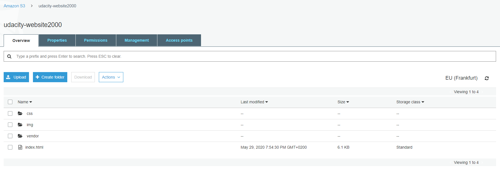
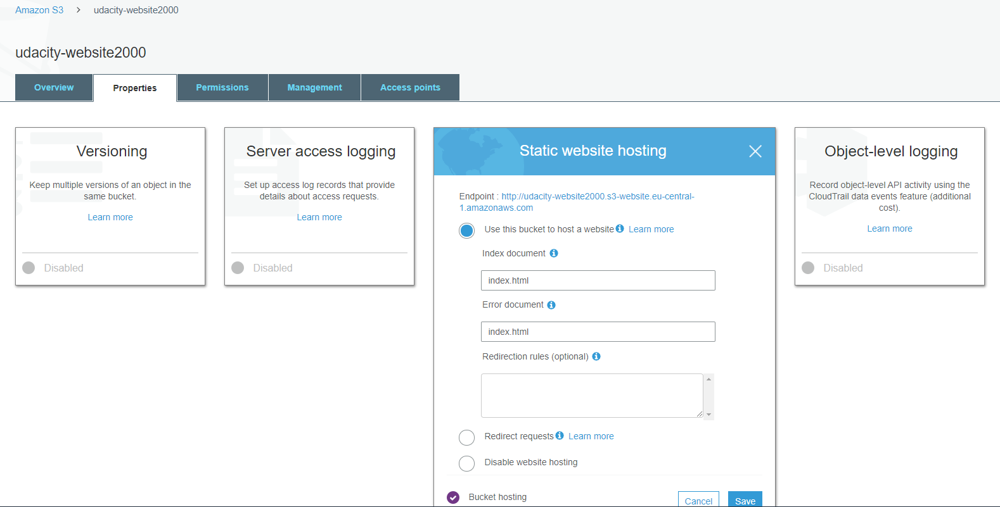
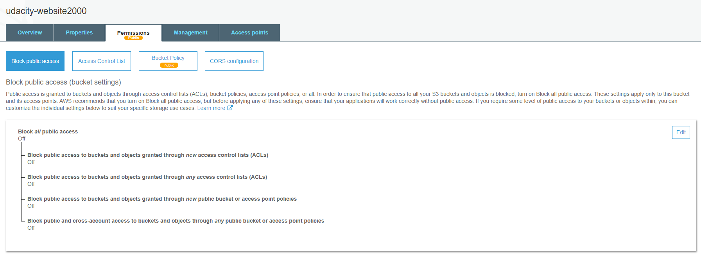
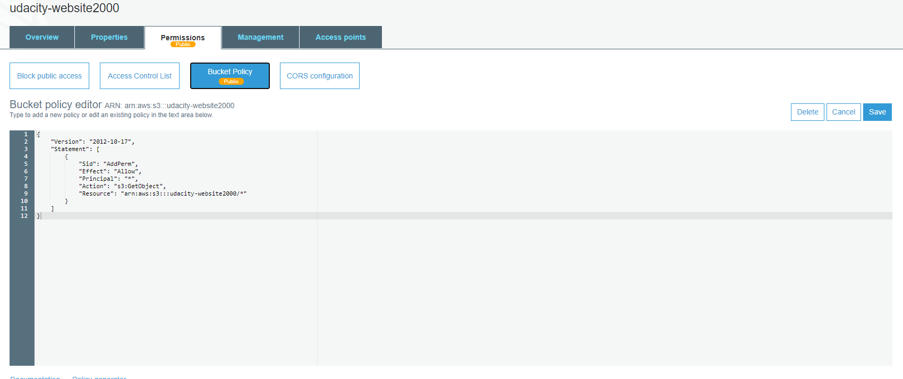
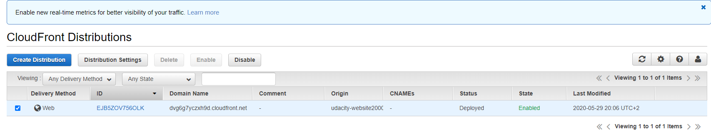

# Deploy Static Website on AWS

## In this project, I will deploy a static website to AWS using S3, CloudFront, and IAM.

The files included are: 

index.html - The Index document for the website.
/img - The background image file for the website.
/vendor - Bootssrap CSS framework, Font, and JavaScript libraries needed for the website to function.
/css - CSS files for the website.

LINK:
http://udacity-website2000.s3.eu-central-1.amazonaws.com/index.html

